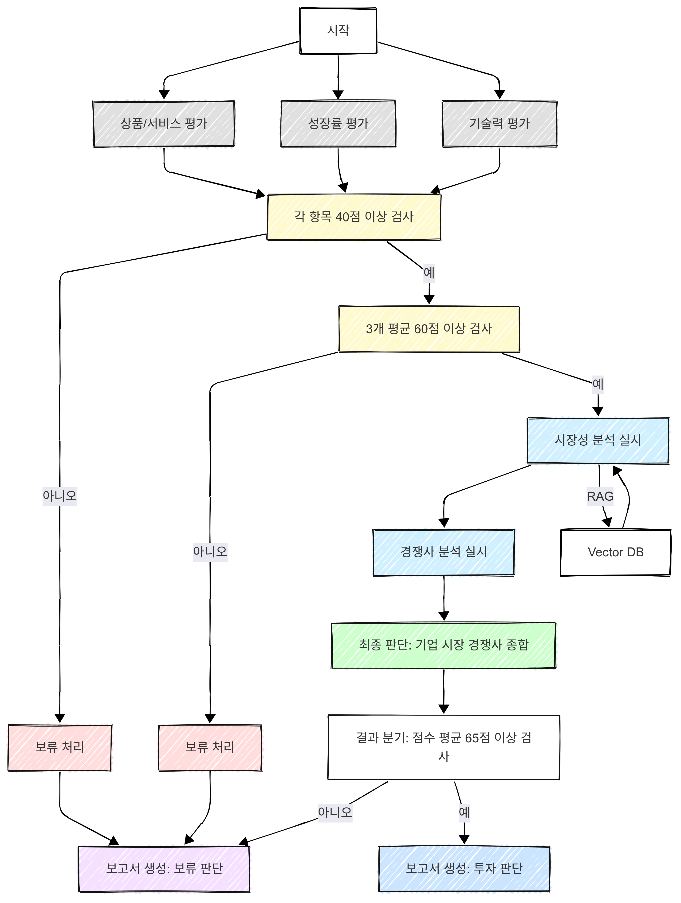
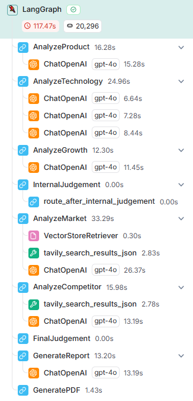

# AI Startup Investment Evaluation Agent
본 프로젝트는 인공지능 스타트업에 대한 투자 가능성을 자동으로 평가하는 에이전트를 설계하고 구현한 프로젝트입니다.

## Overview
- Objective: AI 스타트업의 상품 경쟁력, 기술력, 시장성, 성장 가능성, 경쟁사 분석 등을 종합적으로 평가하여 투자 적합성을 판단

- Method: LangGraph 기반의 AI 에이전트 흐름 구성 + LangChain + GPT 기반 평가 자동화

- Tools: LangGraph, LangChain, OpenAI GPT-4o, ReportLab, Python

## Features
- 기업 내 외부 항목 구분 평가 
    - 내부 항목 : 상품, 기술, 성장성
    - 외부 항목 : 시장성, 경쟁사

- LLM 기반 항목별 자동 평가
    - 신뢰도 향상을 위해 평가 점수와 근거 제시
    - JSON OutputParser를 통한 구조화된 응답 처리

- Ensemble Retriever를 통한 고품질 정보 검색
    - BM25 + Vector Search 조합으로 검색 정확도 향상

- Pinecone Vector Database 활용
    - 확장 가능한 클라우드 벡터 저장소로 대용량 문서 처리
    - 실시간 유사도 검색 지원
    - ChromaDB 대신 Pinecone만 사용하여 일관성 확보

- 평가 결과 자동 종합 및 투자 판단 (투자 / 보류)

- 평가 결과를 기반으로 PDF 보고서 자동 생성

- Agent 기반 구성으로 항목별 모듈화 및 확장 가능

## Tech Stack 

| Category   | Details                             |
|------------|-------------------------------------|
| Framework  | LangGraph, LangChain, Python        |
| LLM        | GPT-4o via OpenAI API               |
| Output Parser | JSON OutputParser with Pydantic     |
| Retrieval  | Ensemble Retriever (BM25 + Vector)  |
| VectorDB   | Pinecone                                |
| PDF Report | ReportLab                           |
| State Mgmt | TypedDict 기반 상태 공유 (AgentState)|
| Logging    | LangSmith (langchain_teddynote)     |

## Agents
- Agent `Product`: 상품 경쟁력을 평가함
- Agent `Technology`: 기술 수준과 차별성을 평가함
- Agent `Growth`: 성장 가능성과 시장 트렌드 적합성을 평가함
- Agent `InternalJudgement`: 상품, 기술, 성장성을 종합하여 내부 기준을 평가함
- Agent `Market`: 시장성(시장 수요, 산업 전망 등)을 평가함
- Agent `Competition`: 경쟁사와의 비교를 통해 차별성을 평가함
- Agent `FinalJudgement` : 최종 투자 여부를 판단함
- Agent `GenerateReport`: 평가 결과를 종합하여 보고서를 생성함
- Agent `GeneratePDF`: 보고서를 pdf 형식으로 변환함

## Architecture


## LangSmith Tracking Example


## Directory Structure
```
├── data/                                 # 벡터 DB 활용 문서
├── investment_reports/                   # 평가 보고서 저장
├── models/                               # Pydantic 모델 및 스키마
│   ├── __init__.py                       # 패키지 초기화
│   └── schemas.py                        # Pydantic 모델 정의
├── startup_invest_evaluation.py          # 메인 실행 스크립트
├── startup_invest_evaluation.ipynb       # Jupyter 노트북 버전
├── requirements.txt                      # Python 패키지 의존성
└── README.md
```

## Environment Setup

### Required API Keys
다음 API 키들을 `.env` 파일에 설정해야 합니다:

```bash
# OpenAI API 설정
OPENAI_API_KEY=your_openai_api_key_here

# Tavily API 설정
TAVILY_API_KEY=your_tavily_api_key_here

# Naver API 설정
NAVER_CLIENT_ID=your_naver_client_id_here
NAVER_CLIENT_SECRET=your_naver_client_secret_here

# Pinecone 설정 (필수)
PINECONE_API_KEY=your_pinecone_api_key_here
PINECONE_ENVIRONMENT=your_pinecone_environment_here
PINECONE_INDEX_NAME=venture-evaluation

# LangSmith 설정 (선택사항)
LANGCHAIN_API_KEY=your_langsmith_api_key_here
LANGCHAIN_TRACING_V2=true
LANGCHAIN_PROJECT=AI-project
```

### Installation
```bash
# 가상환경 생성 및 활성화
python -m venv venv
source venv/bin/activate  # Windows: venv\Scripts\activate

# 패키지 설치
pip install -r requirements.txt
```

### Usage
```bash
# Python 스크립트 실행
python startup_invest_evaluation.py

# 또는 Jupyter 노트북 실행
jupyter notebook startup_invest_evaluation.ipynb
```

## Contributors 
- 김상헌 : 결론 도출 및 PDF 출력 에이전트
- 김지현 : 경쟁사 분석 에이전트, Vector DB 구축
- 손상범 : 기업 자체 평가 에이전트
- 이상현 : 기업 자체 평가 에이전트
- 이소희 : 시장 분석 에이전트
